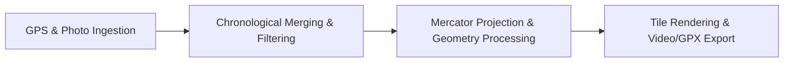

# Architecture & System Design

**PicturesToGpx** is an extensible location aggregation, mapping, and video production engine implemented in C# (.NET Framework 4.8 / C# 8.0).

---

## High-Level Pipeline

The system processes geospatial data through four primary stages:



### 1. Ingestion Layer
* Scans configured photo directories for JPEG files and extracts GPS latitude/longitude, UTC timestamp, and Dilution of Precision (DOP) via [`ImageUtility`](../PicturesToGpx/ImageUtility.cs).
* Reads GPS tracks from Google Location History (`Records.json` and KML), Garmin FIT binaries (`.fit`, `.fit.gz`), and Endomondo JSON logs.
* Caches extracted positions to disk in `WorkingDirectory` (`<folder-slug>-cached-positions.json` and `endomondo-positions.json`) to accelerate subsequent runs.

### 2. Synchronization & Filtering Layer
* Merges multiple sorted streams using a two-pointer merge algorithm ([`EnumerableUtils.Merge`](../PicturesToGpx/EnumerableUtils.cs#L9-L40)).
* Filters out low-precision points (e.g., photo EXIF `DilutionOfPrecision >= 10` or Google Timeline points exceeding `GoogleTimelineMinimumAccuracyMeters`).
* Truncates dataset to the user-specified interval `[StartTime, EndTime)`.

### 3. Geometry & Map Projection Layer
* Converts WGS84 geographic coordinates (latitude, longitude in degrees) to Spherical Mercator projection coordinates in meters ([`LocationUtils.ToMercator`](../PicturesToGpx/Geometry/LocationUtils.cs#L20-L24)).
* Calculates optimal zoom level and bounding box enclosing all points for the target resolution.
* Maps Mercator coordinates into pixel space on the canvas ([`Mapper.GetPixels`](../PicturesToGpx/Mapper.cs#L150-L153)).
* Reduces redundant points via distance decimation ([`GeometryUtils.SkipTooClose`](../PicturesToGpx/Geometry/GeometryUtils.cs#L9-L40)) and smooths curves using Chaikin's subdivision algorithm ([`GeometryUtils.SmoothLineChaikin`](../PicturesToGpx/Geometry/GeometryUtils.cs#L42-L75)).

### 4. Output Generation Layer
* **GPX / JSON Track Export**: Emits [`track.gpx`](../PicturesToGpx/Program.cs#L371) (segmented into tracks when gaps exceed 5 hours) and [`track.json`](../PicturesToGpx/Program.cs#L372).
* **Map Tile Fetching & Compositing**: Retrieves raster Google Maps roadmap tiles via [`Fetcher`](../PicturesToGpx/Fetcher.cs) with local disk caching in `TileCacheDirectory`, rendering them on GDI+ bitmap.
* **Video Encoding**: Generates an MJPEG `.avi` video ([`map.avi`](../PicturesToGpx/Program.cs#L228)) via `SharpAvi`, drawing the route progressively with daily color switching, distance traveled (in km), and local time based on IANA timezone lookup (`GeoTimeZone` / `TimeZoneConverter`).
* **Still Images**: Saves empty or populated map images (`.png`) when configured.

---

## Solution Structure

```
PicturesToGpx/
├── PicturesToGpx/             # Main application executable
│   ├── Geometry/              # Coordinates, projections, bounding boxes, and smoothing
│   │   ├── BoundingBox.cs
│   │   ├── ExifParser.cs
│   │   ├── GeometryUtils.cs
│   │   ├── LatLongParser.cs
│   │   ├── LocationUtils.cs
│   │   └── Position.cs
│   ├── Gps/                   # GPS track file readers (FIT, KML, Google JSON, Endomondo)
│   │   ├── EndomondoJsonReader.cs
│   │   ├── FitReader.cs
│   │   ├── GoogleTimelineJsonReader.cs
│   │   ├── GoogleTimelineKmlReader.cs
│   │   ├── GpsReaderUtil.cs
│   │   └── IGpsReader.cs
│   ├── ConfigReader.cs        # JSON config loader
│   ├── DirectoryUtilities.cs  # Recursive directory search & file-to-points mapping
│   ├── EnumerableUtils.cs     # Sorted stream merging & linq utilities
│   ├── Fetcher.cs             # HTTP tile fetcher with disk cache
│   ├── ImageUtility.cs        # Photo EXIF metadata parser
│   ├── Mapper.cs              # Canvas drawing, line rendering, text overlays, bitmap stashing
│   ├── Program.cs             # CLI entry point and pipeline orchestration
│   ├── Settings.cs            # Strongly-typed configuration schema
│   ├── Tiler.cs               # Tile bounding box calculation and tile grid stitching
│   └── TilerConfig.cs         # Tile drawing options
└── PicturesToGpx.Test/        # MSTest unit test suite
    ├── Configs/               # Test configuration files
    ├── Gps/                   # Test GPS files (FIT, JSON, KML)
    ├── ConfigReaderTest.cs
    ├── DirectoryUtilitiesTest.cs
    ├── EnumerableUtilsTest.cs
    ├── ExifParserTest.cs
    ├── LatLongParserTest.cs
    ├── MetadataReaderTest.cs
    └── TempDirectory.cs
```

---

## Key Dependencies & Libraries

* **.NET Framework 4.8 / C# 8.0**
* **Newtonsoft.Json** (13.0.1): Configuration and track serialization/deserialization.
* **SharpAvi** (3.0.1): Native MJPEG AVI video stream encoding.
* **SharpKml.Core** (5.2.0): KML parsing for Google Timeline tracks.
* **MetadataExtractor** (2.7.2): High-performance EXIF tag parsing from JPEG images.
* **GeoTimeZone** (5.1.0) & **TimeZoneConverter**: Resolves coordinates to IANA time zones and local offsets.
* **MKCoolsoft.GPXLib** (1.0.2): GPX file construction and export.
* **Dynastream FIT SDK** (`Fit.dll`): Binary Garmin FIT track decoder.
* **NetTopologySuite** (2.5.0): Geospatial core structures.
