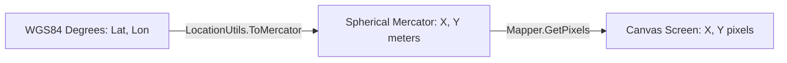

# Rendering Pipeline & Video Generation

The rendering engine converts raw geospatial coordinates into cartographic map visualizations and animated video frames.

---

## 1. Projections & Coordinates

* **Spherical Mercator Projection** ([`LocationUtils.cs`](../PicturesToGpx/Geometry/LocationUtils.cs)): Converts geographic WGS84 latitude and longitude into projected Mercator planar coordinates in meters.
* **Canvas Subpixel Mapping** ([`Mapper.cs`](../PicturesToGpx/Mapper.cs)): Scales Mercator bounds to the canvas preserving full floating-point precision (`PointF`), avoiding integer snapping and stair-stepping artifacts.

---

## 2. Tile Fetching & Compositing

* **Zoom Level Selection** ([`LocationUtils.GetZoomLevel`](../PicturesToGpx/Geometry/LocationUtils.cs)): Computes the maximum integer zoom level where the route bounding box fully fits within the target pixel dimensions.
* **Tile Grid Download & Caching** ([`Fetcher.cs`](../PicturesToGpx/Fetcher.cs), [`Tiler.cs`](../PicturesToGpx/Tiler.cs)):
  * Computes the overlapping tile coordinates $(x, y)$ for the bounding box at the selected zoom level.
  * Fetches roadmap raster tiles from Google Maps.
  * Caches downloaded tiles on disk in `TileCacheDirectory` using sanitized URL filenames.
* **Compositing**: Renders the tile grid onto a GDI+ bitmap canvas with `SmoothingMode.HighQuality` and `InterpolationMode.HighQualityBicubic`.

---

## 3. Route Decimation & Smoothing

* **Pixel Proximity Decimation** ([`GeometryUtils.SkipTooClose`](../PicturesToGpx/Geometry/GeometryUtils.cs)): Filters out intermediate points that are too close in pixel space (`MinPixelProximity`), reducing point density without losing visual detail.
* **Chaikin's Smoothing Algorithm** ([`GeometryUtils.SmoothLineChaikin`](../PicturesToGpx/Geometry/GeometryUtils.cs)):
  * Applies symmetric iterative corner-cutting subdivision across segments ($Q_i = (1-u)P_i + u P_{i+1}$, $R_i = u P_i + (1-u)P_{i+1}$) to generate smooth curved paths through the discrete GPS coordinates.
  * Configured via `WhereToRound` and `MaxIterationCount`.

---

## 4. Multi-Layer Route Styling & Video Output

* **High-Quality Multi-Layer Line Rendering** ([`Mapper.cs`](../PicturesToGpx/Mapper.cs)):
  * **Round Caps & Joins**: All strokes use `LineCap.Round` and `LineJoin.Round`, ensuring adjacent segments join seamlessly without pixel gaps or triangular notches.
  * **Layer 1 - Soft Drop Shadow**: 11px semi-transparent ambient shadow (`#30000000`) providing depth over the map.
  * **Layer 2 - Contrast Casing / Border**: 8px dark slate border (`#B014181C`) ensuring maximum legibility across both bright cities and dark forests/water.
  * **Layer 3 - Vibrant Route Core**: 5px primary color stroke corresponding to the active day color.
* **Video Encoding & Animation** ([`Program.cs`](../PicturesToGpx/Program.cs)):
  * Uses `SharpAvi` with an MJPEG video encoder (`MJpegWpfVideoEncoder`) at the configured resolution and framerate.
  * **Animated Leading Head Marker**: Renders a multi-ring glowing concentric pulse dot at the moving tip of the route animation.
* **Dynamic Overlays & Stashing** ([`TelemetryOverlayRenderer.cs`](../PicturesToGpx/TelemetryOverlayRenderer.cs), [`Mapper.cs`](../PicturesToGpx/Mapper.cs)):
  * **Daily Color Switching**: Cycles through configured `DayColors` as the local calendar day changes, resolving time zones via `GeoTimeZone` / `TimeZoneConverter`.
  * **Telemetry Bottom Bar**: Renders a sleek translucent dark HUD bar across the bottom of the frame:
    * **Left**: Formatted local date & time including minutes (`ddd, d MMM • HH:mm`).
    * **Center**: Active day indicator with a colored accent circle matching the current day's route line color (`● Day X`).
    * **Right**: Cumulative distance in integer kilometers (e.g. `673 km`), calculated directly from high-resolution raw GPS points.
  * **Bitmap Stashing**: Preserves underlying path drawings across transient frame overlays via `Stash()` and `StashPop()`.
* **Still Images**: Saves empty base maps and populated route images as PNG files when configured.
