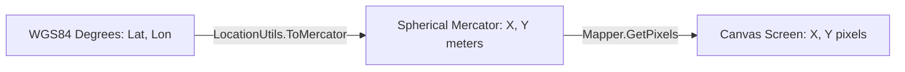

# Rendering Pipeline & Video Generation

The rendering engine converts raw geospatial coordinates into cartographic map visualizations and animated video frames.

---

## 1. Projections & Coordinates

* **Spherical Mercator Projection** ([`LocationUtils.cs`](../PicturesToGpx/Geometry/LocationUtils.cs)): Converts geographic WGS84 latitude and longitude into projected Mercator planar coordinates in meters.
* **Canvas Mapping** ([`Mapper.cs`](../PicturesToGpx/Mapper.cs)): Scales Mercator bounds to the target pixel resolution.

---

## 2. Tile Fetching & Compositing

* **Zoom Level Selection** ([`LocationUtils.GetZoomLevel`](../PicturesToGpx/Geometry/LocationUtils.cs)): Computes the maximum integer zoom level where the route bounding box fully fits within the target pixel dimensions.
* **Tile Grid Download & Caching** ([`Fetcher.cs`](../PicturesToGpx/Fetcher.cs), [`Tiler.cs`](../PicturesToGpx/Tiler.cs)):
  * Computes the overlapping tile coordinates $(x, y)$ for the bounding box at the selected zoom level.
  * Fetches roadmap raster tiles from Google Maps.
  * Caches downloaded tiles on disk in `TileCacheDirectory` using sanitized URL filenames.
* **Compositing**: Renders the tile grid onto a GDI+ bitmap canvas.

---

## 3. Route Decimation & Smoothing

* **Pixel Proximity Decimation** ([`GeometryUtils.SkipTooClose`](../PicturesToGpx/Geometry/GeometryUtils.cs)): Filters out intermediate points that are too close in pixel space (`MinPixelProximity`), reducing point density without losing visual detail.
* **Chaikin's Smoothing Algorithm** ([`GeometryUtils.SmoothLineChaikin`](../PicturesToGpx/Geometry/GeometryUtils.cs)):
  * Applies iterative corner-cutting subdivision to generate smooth curved paths through the discrete GPS coordinates.
  * Configured via `WhereToRound` and `MaxIterationCount`.

---

## 4. Video & Still Output

* **Video Encoding** ([`Program.cs`](../PicturesToGpx/Program.cs)):
  * Uses `SharpAvi` with an MJPEG video encoder (`MJpegWpfVideoEncoder`) at the configured resolution and framerate.
  * Draws route segments progressively across frames based on the target video duration.
* **Dynamic Overlays & Stashing** ([`Mapper.cs`](../PicturesToGpx/Mapper.cs)):
  * **Daily Color Switching**: Cycles through configured `DayColors` as the local calendar day changes, resolving time zones via `GeoTimeZone` / `TimeZoneConverter`.
  * **Distance Counter**: Displays cumulative ellipsoidal distance in kilometers.
  * **Timestamp Overlay**: Displays the local formatted date and time.
  * **Bitmap Stashing**: Preserves underlying path drawings across transient frame overlays via `Stash()` and `StashPop()`.
* **Still Images**: Saves empty base maps and populated route images as PNG files when configured.
